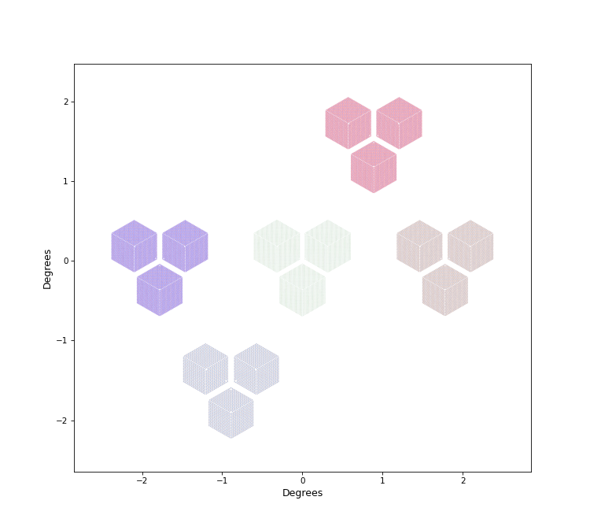
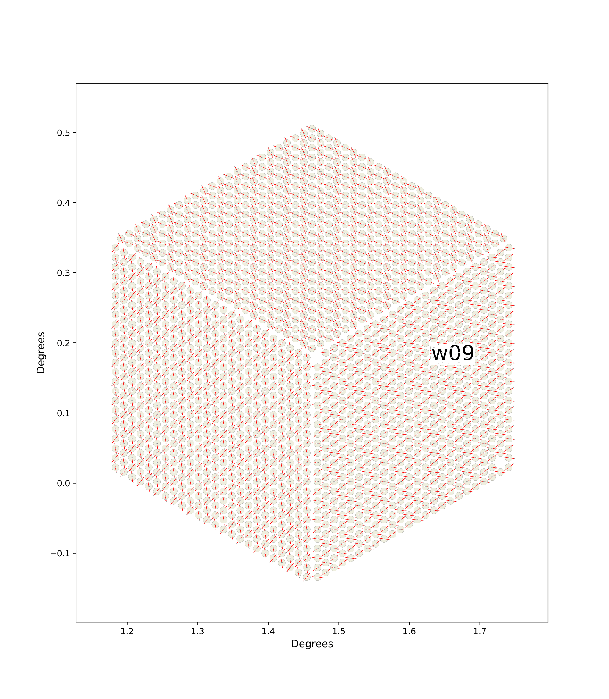
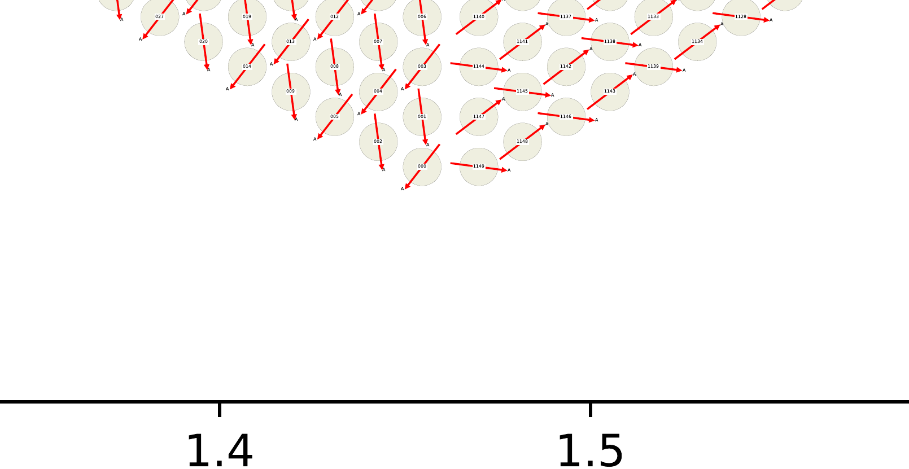

.. _cli_primecam:

Command Line Tools for Prime-Cam
=================================

The command line interface to sotodlib is mostly convenience wrappers around high level functions in the package.

Hardware Configuration
-------------------------

There are several tools for simulating, selecting subsets from, and plotting
hardware configurations.  Currently the code writes hardware configuration data
into the `TOML <https://github.com/toml-lang/toml/wiki>`_ format, which can
represent basic scalar data types as well as lists and dictionaries.  Under the
hood it `uses the python toml package <https://github.com/uiri/toml>`_.  This
format is simple to read and even edit manually (hopefully that will be a rare
occurrence!).  By default the dumping functions write this data in gzipped
files and loading supports both gzipped and uncompressed TOML files.

Simulating
~~~~~~~~~~~~~~~~~~~

Until we have real hardware properties we can create a mock configuration with
this script:

.. include:: _static/primecam_hardware_sim.inc

You can specify the output file root name (the toml and gz extensions will be
added) and whether to overwrite any existing file by the same name.

Basic Info
~~~~~~~~~~~~~~~~

You can dump very basic info about a hardware file with this tool:

.. include:: _static/so_hardware_info.inc

If you need more details, you should just get an interactive python session and
load the hardware model and explore it.

Selecting / Trimming Detectors
~~~~~~~~~~~~~~~~~~~~~~~~~~~~~~~~~~~

Starting with a large hardware model for the whole experiment, we usually want to select a subset of the detectors in order to do some analysis task.  You can use this command line tool to read an existing hardware configuration, apply some selection, and dump out the result as a new configuration.  Under the hood this just uses the :meth:`sotodlib.hardware.Hardware.select` method.

.. include:: _static/so_hardware_trim.inc

Basically you can do a coarse selection by telescope or tube, as well as apply other selection criteria on the detector properties.  See the example below.

Visualization
~~~~~~~~~~~~~~~~~

.. include:: _static/primecam_hardware_plot.inc

Example
~~~~~~~~~~~~~~~~~~~~~~~~

Putting the previously discussed tools together, let's make a plot of just detectors on the 350 GHz module that are in wafer 09, and have "A" polarization ("A"/"B" are the 2 orthogonal polarizations).  This is selection is purely to demonstrate the use of the tools.  First simulate the full hardware configuration::

    %> primecam_hardware_sim --out pc_hardware --overwrite

    Getting example config...
    Simulating detectors for telescope LAT...
    Dumping config to pc_hardware.toml.gz...

Although the output file is only a few MB, we can see it has a lot of stuff in there::

    %> so_hardware_info pc_hardware.toml.gz

    Loading hardware file pc_hardware.toml.gz...
    bands       :     7 objects
        PC_specchip, PC_eorspec, PC_eor350, PC_eor250, PC_f850, PC_f350, PC_f280
    wafer_slots :    15 objects
        w00, w01, w02, w03, w04, w05, w06, w07, w08, w09, w10, w11, w12, w13, 
        w14
    tube_slots  :     5 objects
        c1, i5, i6, i2, i3
    telescopes  :     1 objects
        LAT
    card_slots  :    15 objects
        card_slot06, card_slot07, card_slot08, card_slot09, card_slot10, 
        card_slot11, card_slot12, card_slot13, card_slot14, card_slot03, 
        card_slot04, card_slot05, card_slot00, card_slot01, card_slot02
    crate_slots :     3 objects
        crate_slot00, crate_slot01, crate_slot02
    detectors   : 57054 objects
        (Too many to print)

This is the kind of file that in the future can be versioned and be associated with a valid time range.  It should really just be used as the starting input. Now we can pre-select detectors in the 350 GHz module::

    %> so_hardware_trim --hardware pc_hardware.toml.gz \
       --out pc_hardware_f350 --overwrite \
       --match 'band:PC_f350'

    Loading hardware from pc_hardware.toml.gz...
    Selecting detectors from:
      band = r'PC_f350'
    Dumping selected config to pc_hardware_f350.toml.gz...

This produces a file called "pc_hardware_f350.toml.gz".  This has only detectors in the 350 GHz module::

    %> so_hardware_info pc_hardware_f350.toml.gz

    Loading hardware file pc_hardware_f350.toml.gz...
    card_slots  :     3 objects
        card_slot10, card_slot09, card_slot11
    crate_slots :     1 objects
        crate_slot00
    bands       :     1 objects
        PC_f350
    tube_slots  :     1 objects
        i5
    telescopes  :     1 objects
        LAT
    wafer_slots :     3 objects
        w10, w11, w09
    detectors   : 10356 objects
        (Too many to print)

We can also use the plotting function to visualise the focal planes of all the modules of Prime-cam::

    %> primecam_hardware_plot --hardware pc_hardware.toml.gz \
       --out pc.pdf

    Loading hardware file pc_hardware.toml.gz...
    Generating detector plot...

This outputs a PDF that you can "zoom in" to see details, but the image here is
just a low-res PNG.

Back to our original selection goal.  We can use lists of values to match detector properties or valid python regular expressions.  We shall trim out detectors in wafer 09 having "A' polarization with::

    %> so_hardware_trim --hardware pc_hardware_f350.toml.gz \
       --out my_dets_f350 --overwrite --match \
       "wafer_slot:09" \
       "pol:A" \

    Loading hardware from pc_hardware_f350.toml.gz...
    Selecting detectors from:
      wafer_slot = r'w09'
      pol = r'A'
    Dumping selected config to my_dets_f350.toml.gz...

Now explore this selection of detectors::

    %> so_hardware_info my_dets_f350.toml.gz

    Loading hardware file my_dets_f350.toml.gz...
    card_slots  :     1 objects
        card_slot09
    crate_slots :     1 objects
        crate_slot00
    bands       :     1 objects
        PC_f350
    tube_slots  :     1 objects
        i5
    telescopes  :     1 objects
        LAT
    wafer_slots :     1 objects
        w09
    detectors   :  1726 objects
        w09_p000_PC_f350_A, w09_p001_PC_f350_A, w09_p002_PC_f350_A, 
        w09_p003_PC_f350_A, w09_p004_PC_f350_A, w09_p005_PC_f350_A, 
        w09_p006_PC_f350_A, w09_p007_PC_f350_A, w09_p008_PC_f350_A, 
        w09_p009_PC_f350_A, w09_p010_PC_f350_A, w09_p011_PC_f350_A, 
        w09_p012_PC_f350_A, w09_p013_PC_f350_A, w09_p014_PC_f350_A, 
        w09_p015_PC_f350_A, w09_p016_PC_f350_A, w09_p017_PC_f350_A, 
        w09_p018_PC_f350_A, w09_p019_PC_f350_A, w09_p020_PC_f350_A, 
        w09_p021_PC_f350_A, w09_p022_PC_f350_A, w09_p023_PC_f350_A, 
        w09_p024_PC_f350_A, w09_p025_PC_f350_A, w09_p026_PC_f350_A, 
        w09_p027_PC_f350_A, w09_p028_PC_f350_A, w09_p029_PC_f350_A, 
        w09_p030_PC_f350_A, w09_p031_PC_f350_A, w09_p032_PC_f350_A, 
        w09_p033_PC_f350_A, w09_p034_PC_f350_A, w09_p035_PC_f350_A, 
        w09_p036_PC_f350_A, w09_p037_PC_f350_A, w09_p038_PC_f350_A, 
        w09_p039_PC_f350_A, w09_p040_PC_f350_A, w09_p041_PC_f350_A, 
        w09_p042_PC_f350_A, w09_p043_PC_f350_A, w09_p044_PC_f350_A, 
        w09_p045_PC_f350_A, w09_p046_PC_f350_A, w09_p047_PC_f350_A, 
        w09_p048_PC_f350_A, w09_p049_PC_f350_A, w09_p050_PC_f350_A, 
        w09_p051_PC_f350_A, w09_p052_PC_f350_A, w09_p053_PC_f350_A, 
        w09_p054_PC_f350_A, w09_p055_PC_f350_A, w09_p056_PC_f350_A, 
        w09_p057_PC_f350_A, w09_p058_PC_f350_A, w09_p059_PC_f350_A, 
        w09_p060_PC_f350_A, w09_p061_PC_f350_A, w09_p062_PC_f350_A, 
        w09_p063_PC_f350_A, w09_p064_PC_f350_A, w09_p065_PC_f350_A, 
        w09_p066_PC_f350_A, w09_p067_PC_f350_A, w09_p068_PC_f350_A, 
        w09_p069_PC_f350_A, w09_p070_PC_f350_A, w09_p071_PC_f350_A, 
        w09_p072_PC_f350_A, w09_p073_PC_f350_A, w09_p074_PC_f350_A, 
        w09_p075_PC_f350_A, w09_p076_PC_f350_A, w09_p077_PC_f350_A, 
        w09_p078_PC_f350_A, w09_p079_PC_f350_A, w09_p080_PC_f350_A, 
        w09_p081_PC_f350_A, w09_p082_PC_f350_A, w09_p083_PC_f350_A, 
        w09_p084_PC_f350_A, w09_p085_PC_f350_A, w09_p086_PC_f350_A, 
        w09_p087_PC_f350_A, w09_p088_PC_f350_A, w09_p089_PC_f350_A, 
        w09_p090_PC_f350_A, w09_p091_PC_f350_A, w09_p092_PC_f350_A, 
        w09_p093_PC_f350_A, w09_p094_PC_f350_A, w09_p095_PC_f350_A, 
        w09_p096_PC_f350_A, w09_p097_PC_f350_A, w09_p098_PC_f350_A, 
        w09_p099_PC_f350_A, w09_p100_PC_f350_A, w09_p101_PC_f350_A, 
        w09_p102_PC_f350_A, w09_p103_PC_f350_A, w09_p104_PC_f350_A, 
        w09_p105_PC_f350_A, w09_p106_PC_f350_A, w09_p107_PC_f350_A, 
        w09_p108_PC_f350_A, w09_p109_PC_f350_A, w09_p110_PC_f350_A, 
        w09_p111_PC_f350_A, w09_p112_PC_f350_A, w09_p113_PC_f350_A, 
        w09_p114_PC_f350_A, w09_p115_PC_f350_A, w09_p116_PC_f350_A, 
        w09_p117_PC_f350_A, w09_p118_PC_f350_A, w09_p119_PC_f350_A, 
        w09_p120_PC_f350_A, w09_p121_PC_f350_A, w09_p122_PC_f350_A, 
        w09_p123_PC_f350_A, w09_p124_PC_f350_A, w09_p125_PC_f350_A, 
        w09_p126_PC_f350_A, w09_p127_PC_f350_A, w09_p128_PC_f350_A, 
        w09_p129_PC_f350_A, w09_p130_PC_f350_A, w09_p131_PC_f350_A, 
        w09_p132_PC_f350_A, w09_p133_PC_f350_A, w09_p134_PC_f350_A, 
        w09_p135_PC_f350_A, w09_p136_PC_f350_A, w09_p137_PC_f350_A, 
        w09_p138_PC_f350_A, w09_p139_PC_f350_A, w09_p140_PC_f350_A, 
        w09_p141_PC_f350_A, w09_p142_PC_f350_A, w09_p143_PC_f350_A, 
        w09_p144_PC_f350_A, w09_p145_PC_f350_A, w09_p146_PC_f350_A, 
        w09_p147_PC_f350_A, w09_p148_PC_f350_A, w09_p149_PC_f350_A, 
        w09_p150_PC_f350_A, w09_p151_PC_f350_A, w09_p152_PC_f350_A, 
        w09_p153_PC_f350_A, w09_p154_PC_f350_A, w09_p155_PC_f350_A, 
        w09_p156_PC_f350_A, w09_p157_PC_f350_A, w09_p158_PC_f350_A, 
        w09_p159_PC_f350_A, w09_p160_PC_f350_A, w09_p161_PC_f350_A, 
        w09_p162_PC_f350_A, w09_p163_PC_f350_A, w09_p164_PC_f350_A, 
        w09_p165_PC_f350_A, w09_p166_PC_f350_A, w09_p167_PC_f350_A, 
        w09_p168_PC_f350_A, w09_p169_PC_f350_A, w09_p170_PC_f350_A, 
        w09_p171_PC_f350_A, w09_p172_PC_f350_A, w09_p173_PC_f350_A, 
        w09_p174_PC_f350_A, w09_p175_PC_f350_A, w09_p176_PC_f350_A, 
        w09_p177_PC_f350_A, w09_p178_PC_f350_A, w09_p179_PC_f350_A, 
        w09_p180_PC_f350_A, w09_p181_PC_f350_A, w09_p182_PC_f350_A, 
        w09_p183_PC_f350_A, w09_p184_PC_f350_A, w09_p185_PC_f350_A, 
        w09_p186_PC_f350_A, w09_p187_PC_f350_A, w09_p188_PC_f350_A, 
        w09_p189_PC_f350_A, w09_p190_PC_f350_A, w09_p191_PC_f350_A, 
        w09_p192_PC_f350_A, w09_p193_PC_f350_A, w09_p194_PC_f350_A, 
        w09_p195_PC_f350_A, w09_p196_PC_f350_A, w09_p197_PC_f350_A, 
        w09_p198_PC_f350_A, w09_p199_PC_f350_A, w09_p200_PC_f350_A, 
        w09_p201_PC_f350_A, w09_p202_PC_f350_A, w09_p203_PC_f350_A, 
        w09_p204_PC_f350_A, w09_p205_PC_f350_A, w09_p206_PC_f350_A, 
        w09_p207_PC_f350_A, w09_p208_PC_f350_A, w09_p209_PC_f350_A, 
        w09_p210_PC_f350_A, w09_p211_PC_f350_A, w09_p212_PC_f350_A, 
        w09_p213_PC_f350_A, w09_p214_PC_f350_A, w09_p215_PC_f350_A, 
        w09_p216_PC_f350_A, w09_p217_PC_f350_A, w09_p218_PC_f350_A, 
        w09_p219_PC_f350_A, w09_p220_PC_f350_A, w09_p221_PC_f350_A, 
        w09_p222_PC_f350_A, w09_p223_PC_f350_A, w09_p224_PC_f350_A, 
        w09_p225_PC_f350_A, w09_p226_PC_f350_A, w09_p227_PC_f350_A, 
        w09_p228_PC_f350_A, w09_p229_PC_f350_A, w09_p230_PC_f350_A, 
        w09_p231_PC_f350_A, w09_p232_PC_f350_A, w09_p233_PC_f350_A, 
        w09_p234_PC_f350_A, w09_p235_PC_f350_A, w09_p236_PC_f350_A, 
        w09_p237_PC_f350_A, w09_p238_PC_f350_A, w09_p239_PC_f350_A, 
        w09_p240_PC_f350_A, w09_p241_PC_f350_A, w09_p242_PC_f350_A, 
        w09_p243_PC_f350_A, w09_p244_PC_f350_A, w09_p245_PC_f350_A, 
        w09_p246_PC_f350_A, w09_p247_PC_f350_A, w09_p248_PC_f350_A, 
        w09_p249_PC_f350_A, w09_p250_PC_f350_A, w09_p251_PC_f350_A, 
        w09_p252_PC_f350_A, w09_p253_PC_f350_A, w09_p254_PC_f350_A, 
        w09_p255_PC_f350_A, w09_p256_PC_f350_A, w09_p257_PC_f350_A, 
        w09_p258_PC_f350_A, w09_p259_PC_f350_A, w09_p260_PC_f350_A, 
        w09_p261_PC_f350_A, w09_p262_PC_f350_A, w09_p263_PC_f350_A, 
        w09_p264_PC_f350_A, w09_p265_PC_f350_A, w09_p266_PC_f350_A, 
        w09_p267_PC_f350_A, w09_p268_PC_f350_A, w09_p269_PC_f350_A, 
        w09_p270_PC_f350_A, w09_p271_PC_f350_A, w09_p272_PC_f350_A, 
        w09_p273_PC_f350_A, w09_p274_PC_f350_A, w09_p275_PC_f350_A, 
        w09_p276_PC_f350_A, w09_p277_PC_f350_A, w09_p278_PC_f350_A, 
        w09_p279_PC_f350_A, w09_p280_PC_f350_A, w09_p281_PC_f350_A, 
        w09_p282_PC_f350_A, w09_p283_PC_f350_A, w09_p284_PC_f350_A, 
        w09_p285_PC_f350_A, w09_p286_PC_f350_A, w09_p287_PC_f350_A, 
        w09_p288_PC_f350_A, w09_p289_PC_f350_A, w09_p290_PC_f350_A, 
        w09_p291_PC_f350_A, w09_p292_PC_f350_A, w09_p293_PC_f350_A, 
        w09_p294_PC_f350_A, w09_p295_PC_f350_A, w09_p296_PC_f350_A, 
        w09_p297_PC_f350_A, w09_p298_PC_f350_A, w09_p299_PC_f350_A, 
        w09_p300_PC_f350_A, w09_p301_PC_f350_A, w09_p302_PC_f350_A, 
        w09_p303_PC_f350_A, w09_p304_PC_f350_A, w09_p305_PC_f350_A, 
        w09_p306_PC_f350_A, w09_p307_PC_f350_A, w09_p308_PC_f350_A, 
        w09_p309_PC_f350_A, w09_p310_PC_f350_A, w09_p311_PC_f350_A, 
        w09_p312_PC_f350_A, w09_p313_PC_f350_A, w09_p314_PC_f350_A, 
        w09_p315_PC_f350_A, w09_p316_PC_f350_A, w09_p317_PC_f350_A, 
        w09_p318_PC_f350_A, w09_p319_PC_f350_A, w09_p320_PC_f350_A, 
        w09_p321_PC_f350_A, w09_p322_PC_f350_A, w09_p323_PC_f350_A, 
        w09_p324_PC_f350_A, w09_p325_PC_f350_A, w09_p326_PC_f350_A, 
        w09_p327_PC_f350_A, w09_p328_PC_f350_A, w09_p329_PC_f350_A, 
        w09_p330_PC_f350_A, w09_p331_PC_f350_A, w09_p332_PC_f350_A, 
        w09_p333_PC_f350_A, w09_p334_PC_f350_A, w09_p335_PC_f350_A, 
        w09_p336_PC_f350_A, w09_p337_PC_f350_A, w09_p338_PC_f350_A, 
        w09_p339_PC_f350_A, w09_p340_PC_f350_A, w09_p341_PC_f350_A, 
        w09_p342_PC_f350_A, w09_p343_PC_f350_A, w09_p344_PC_f350_A, 
        w09_p345_PC_f350_A, w09_p346_PC_f350_A, w09_p347_PC_f350_A, 
        w09_p348_PC_f350_A, w09_p349_PC_f350_A, w09_p350_PC_f350_A, 
        w09_p351_PC_f350_A, w09_p352_PC_f350_A, w09_p353_PC_f350_A, 
        w09_p354_PC_f350_A, w09_p355_PC_f350_A, w09_p356_PC_f350_A, 
        w09_p357_PC_f350_A, w09_p358_PC_f350_A, w09_p359_PC_f350_A, 
        w09_p360_PC_f350_A, w09_p361_PC_f350_A, w09_p362_PC_f350_A, 
        w09_p363_PC_f350_A, w09_p364_PC_f350_A, w09_p365_PC_f350_A, 
        w09_p366_PC_f350_A, w09_p367_PC_f350_A, w09_p368_PC_f350_A, 
        w09_p369_PC_f350_A, w09_p370_PC_f350_A, w09_p371_PC_f350_A, 
        w09_p372_PC_f350_A, w09_p373_PC_f350_A, w09_p374_PC_f350_A, 
        w09_p375_PC_f350_A, w09_p376_PC_f350_A, w09_p377_PC_f350_A, 
        w09_p378_PC_f350_A, w09_p379_PC_f350_A, w09_p380_PC_f350_A, 
        w09_p381_PC_f350_A, w09_p382_PC_f350_A, w09_p383_PC_f350_A, 
        w09_p384_PC_f350_A, w09_p385_PC_f350_A, w09_p386_PC_f350_A, 
        w09_p387_PC_f350_A, w09_p388_PC_f350_A, w09_p389_PC_f350_A, 
        w09_p390_PC_f350_A, w09_p391_PC_f350_A, w09_p392_PC_f350_A, 
        w09_p393_PC_f350_A, w09_p394_PC_f350_A, w09_p395_PC_f350_A, 
        w09_p396_PC_f350_A, w09_p397_PC_f350_A, w09_p398_PC_f350_A, 
        w09_p399_PC_f350_A, w09_p400_PC_f350_A, w09_p401_PC_f350_A, 
        w09_p402_PC_f350_A, w09_p403_PC_f350_A, w09_p404_PC_f350_A, 
        w09_p405_PC_f350_A, w09_p406_PC_f350_A, w09_p407_PC_f350_A, 
        w09_p408_PC_f350_A, w09_p409_PC_f350_A, w09_p410_PC_f350_A, 
        w09_p411_PC_f350_A, w09_p412_PC_f350_A, w09_p413_PC_f350_A, 
        w09_p414_PC_f350_A, w09_p415_PC_f350_A, w09_p416_PC_f350_A, 
        w09_p417_PC_f350_A, w09_p418_PC_f350_A, w09_p419_PC_f350_A ...

And make a plot (along with detector labels this time)::

    %> primecam_hardware_plot --hardware my_dets_f350.toml.gz --labels

Again, the actual PDF output has "infinite" resolution.  Zooming in to the bottom part of the focal plane in the above plot we can actually see the pixel labels and "A" labels on the arrows that were enabled by the `--labels` option:

